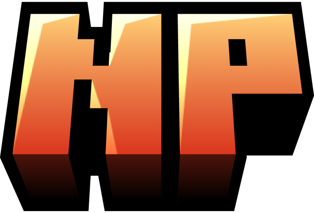

<p align="center">
	
</p>

<h1 align="center">NovaMine</h1>

<p align="center">
	<b>Server software for Minecraft: Bedrock Edition — PocketMine-MP, kept on the latest Bedrock release.</b>
</p>

<p align="center">
	
	
	
	
	
	<a href="https://github.com/Zinkaio/NovaMine/commits"></a>
</p>

---

## What is NovaMine?

NovaMine is a build of [PocketMine-MP](https://github.com/pmmp/PocketMine-MP) maintained by **Zinkaio** for
**NovaPE**, updated to the current Minecraft: Bedrock protocol so servers don't have to wait to accept
players on the newest client.

If you already run a PocketMine-MP server, nothing changes: same config files, same worlds, same plugin API.
Drop the `.phar` in and start it.

| | |
|---|---|
| **Minecraft: Bedrock** | 1.26.44 |
| **Network protocol** | 2168 |
| **Engine base** | PocketMine-MP 5.44.2 |
| **Plugin API** | 5.x — existing PMMP 5 plugins work unchanged |
| **PHP** | 8.1 or newer, 64-bit |

> **Players must be on Minecraft 1.26.44.** Bedrock clients only connect to a server built for their own
> version, so anyone still on 1.26.40 or older will see *outdated client* until they update. Keep the
> `.phar` current and your players will always be able to get in on release day.

---

## What's new

**Performance.** This build is tuned for busy servers — the hot paths that dominate a
tick (entity movement, network) do less work per tick than the previous release, so the
same hardware holds a higher TPS with more players online. Nothing to configure: swap
the `.phar` and you get it.

**Better `/status`.** The status output now reports **CPU load** alongside TPS and
memory — both since boot and since the previous `/status`, and as a share of one core
as well as of the whole machine:

```
Thread count: 4
CPU load (since boot): 3.2% of one core (0.2% of 16 cores)
CPU load (since last /status): 41.7% of one core (2.6% of 16 cores)
```

The since-last-call figure is the useful one while diagnosing lag: it measures the
window between the two commands instead of averaging away a spike across your whole
uptime. It covers the entire process — the main thread, the network thread and the
async workers — so it is real OS CPU time, not the tick-usage percentage already shown
next to TPS.

---

## Quick start

**Windows**

1. Download `NovaMine.phar` and `start.cmd` into an empty folder.
2. Put a 64-bit PHP 8.1+ build in `bin/php/` (see [Requirements](#requirements)).
3. Run `start.cmd`, type `run` at the prompt, and press Enter.

```
your-server/
├── NovaMine.phar
├── start.cmd
└── bin/
    └── php/
        └── php.exe
```

**Linux / macOS**

```bash
php NovaMine.phar
```

The first launch writes `server.properties`, `pocketmine.yml` and a `plugins/` folder next to the `.phar`,
then generates a world. Stop the server cleanly at any time with `stop` in the console.

---

## Updating

When a new Bedrock version ships, replace `NovaMine.phar` with the latest one from here — that file *is*
the server. Stop the server, swap the `.phar`, start it again. Your worlds, configs and plugins are all
stored beside it and are left untouched, so nothing else needs changing.

Keep a copy of the old `.phar` until you've confirmed players can join; rolling back is just swapping it
back.

---

## Requirements

PHP **8.1+, 64-bit**, with the extensions PocketMine-MP needs:

```
chunkutils2  crypto  ctype  curl  date  gmp  hash  igbinary  json
leveldb  mbstring  morton  openssl  pcre  phar  pmmpthread
reflection  simplexml  sockets  spl  yaml  zip  zlib
```

A stock PHP install won't have `pmmpthread`, `leveldb`, `chunkutils2` or `morton`. The easy route is a
prebuilt bundle from [pmmp/PHP-Binaries](https://github.com/pmmp/PHP-Binaries/releases) (the `pm5-latest`
release) — unpack it to `bin/php/` and the start scripts pick it up automatically.

---

## Plugins

NovaMine loads standard PocketMine-MP 5 plugins. Drop a plugin `.phar` into `plugins/` and restart.

- [Poggit](https://poggit.pmmp.io/plugins) — plugin repository
- [Plugin developer docs](https://devdoc.pmmp.io)
- [API reference](https://apidoc.pmmp.io)

---

## Not a vanilla server

This is inherited from PocketMine-MP and worth knowing before you install it: **NovaMine is not a vanilla
Minecraft server.** Vanilla world generation, redstone and mob AI are largely absent — it is built for
custom servers driven by plugins (minigames, hubs, practice servers).

If you want vanilla survival multiplayer, use
[Mojang's official Bedrock server](https://minecraft.net/download/server/bedrock) instead. Otherwise, most
gaps can be filled with plugins.

---

## Credits & licence

Built on [PocketMine-MP](https://github.com/pmmp/PocketMine-MP) by the PMMP Team, licensed under
**LGPL-3.0**. NovaMine is distributed under the same licence — see [LICENSE](LICENSE).

NovaMine, NovaPE and PocketMine-MP are not affiliated with Mojang or Microsoft. Minecraft is a trademark of
Mojang AB. All brands and trademarks belong to their respective owners.
